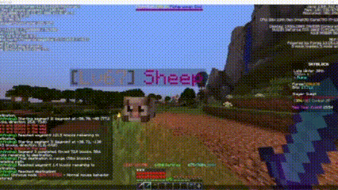

# Mucifex - External Communications Mod for Minecraft 1.8.9

Mucifex is a Minecraft mod for version 1.8.9 that allows external programs to control a Minecraft player using socket connections. This enables creating custom scripts and bots for programming challenges, testing, or automation.

## Features

- Five different socket servers for various functions:
  - **Chat Server (Port 25560)**: Send chat messages or commands
  - **Command Server (Port 25561)**: Execute Minecraft commands
  - **Movement Server (Port 25562)**: Control player movement (WASD, jump, sneak) and mouse actions
  - **Look Server (Port 25563)**: Control player head orientation
  - **Inventory Server (Port 25564)**: Manipulate containers and inventory slots
- **Unfocus Mode (Z key)**: Free the mouse cursor, prevent game pauses, and lock head rotation, allowing you to use external scripts while the game runs in the background
- **Socket Info (M key)**: Display information about all open sockets in the chat

## Demo Video



## Installation

1. Install Minecraft Forge for version 1.8.9
2. Download the Mucifex mod JAR file from the releases or build it yourself
3. Place the JAR file in your Minecraft mods folder
4. Launch Minecraft with the Forge profile

## Building the Mod

To build the mod from source:

1. Clone this repository
2. Run the following commands:
   ```
   ./gradlew clean
   ./gradlew build
   ```
3. The built JAR file will be located in `build/libs/`

## Using the Mod

### Unfocus Mode (Z Key)

1. Press Z to activate unfocus mode
2. The mouse cursor will be released, and the game will not pause when not in focus
3. Head rotation will be locked (mouse movements won't affect where you're looking)
4. Socket commands will still work to move your character and control head position
5. Press Z again to disable unfocus mode and return to normal gameplay

### Socket Information (M Key)

1. Press M at any time to display information about all open sockets
2. The chat will show:
   - Each socket's port number and purpose
   - An example Python command you can click to copy
   - Examples of inventory commands
   - The current status of unfocus mode

## Using with Python

An example Python client is included in the `examples` directory. It demonstrates how to connect to Mucifex and control the player.

```python
import socket

def send_chat(message):
    sock = socket.socket(socket.AF_INET, socket.SOCK_STREAM)
    sock.connect(("localhost", 25560))
    sock.sendall((message + "\n").encode())
    sock.close()

# Send a chat message
send_chat("Hello from Python!")
```

## Socket Protocols

### Chat Server (Port 25560)
Send a single line of text to have the player send it as a chat message.

### Command Server (Port 25561)
Send a single line containing a Minecraft command (with or without the leading slash).

### Movement Server (Port 25562)
Two formats:

1. Movement Commands:
   ```
   direction,duration
   ```
   - `direction`: forward, backward, left, right, jump, sneak
   - `duration`: how long to press the key in milliseconds (optional, default 100ms)

   Example: `forward,1000` (move forward for 1 second)

2. Mouse Actions:
   ```
   right_click,duration
   ```
   - `duration`: how long to hold the right mouse button in milliseconds (optional, default 100ms)
   
   Example: `right_click,500` (hold right-click for 0.5 seconds)

### Look Server (Port 25563)
Two formats:
- Specific direction: `yaw,pitch`
- Look at position: `x,y,z`

Examples:
- `0,0` (look straight ahead)
- `90,0` (look east)
- `100,64,200` (look at block at x=100, y=64, z=200)

### Inventory Server (Port 25564)
Multiple commands for inventory manipulation:

1. Open/Close:
   ```
   open_inventory
   close
   ```
   - `open_inventory`: Press E to open player inventory
   - `close`: Press ESC to close any open container

2. Clicking slots:
   ```
   click,slotId[,type]
   ```
   - `slotId`: The slot number (0-based index)
   - `type`: The click type (left, right, shift) - left is default
   
   Examples:
   - `click,23` (left-click slot 23)
   - `click,10,right` (right-click slot 10)
   - `click,5,shift` (shift-click slot 5)

3. Dragging items:
   ```
   drag,sourceSlot,targetSlot
   ```
   - `sourceSlot`: The source slot number
   - `targetSlot`: The target slot number
   
   Example: `drag,10,36` (move item from slot 10 to 36)

4. Inventory information:
   ```
   status
   ```
   - Shows information about the currently open container
   - Lists slot numbers and contents
   - Helps you identify which slots to click


Credits
Thanks to this repo as this is the basis of the pathfinding system
https://github.com/roger1337/Ophidia


